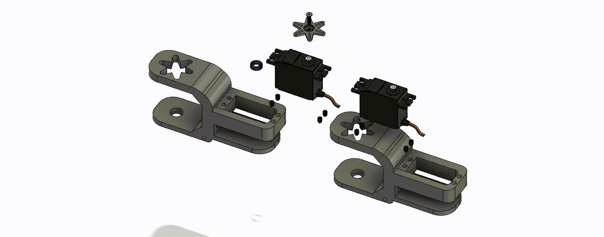
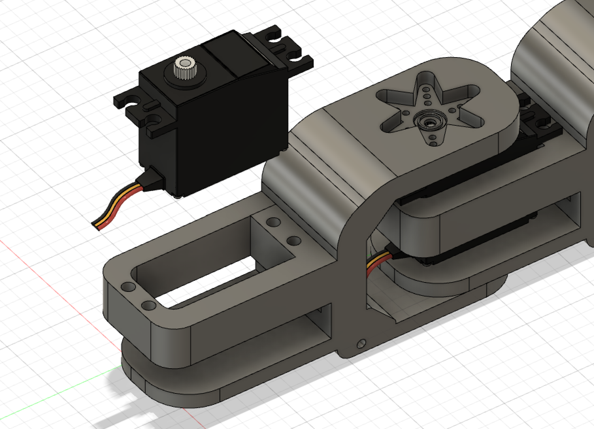
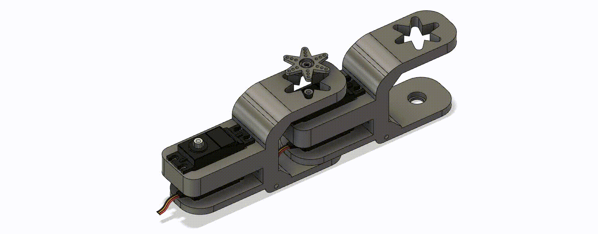
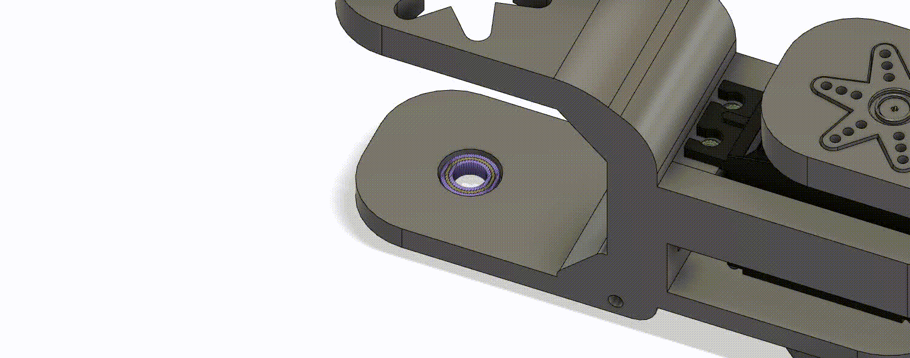
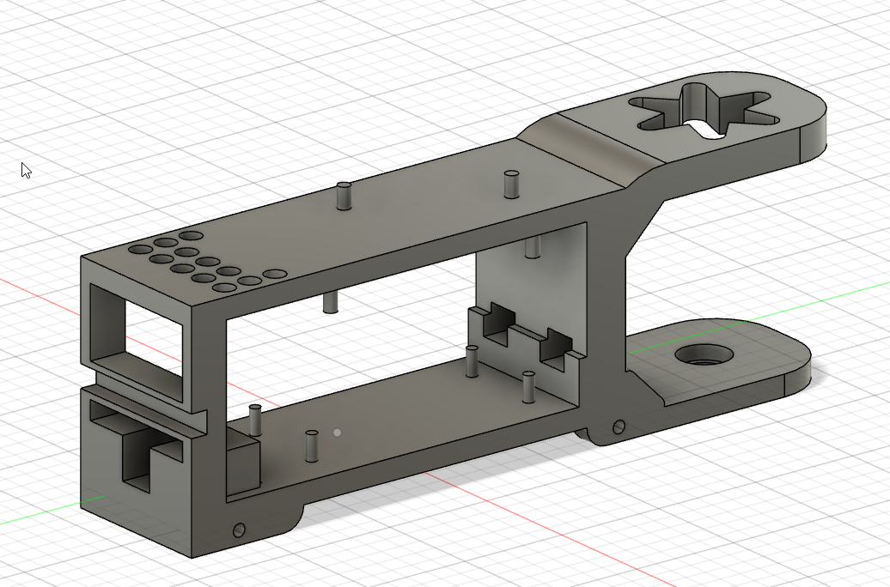
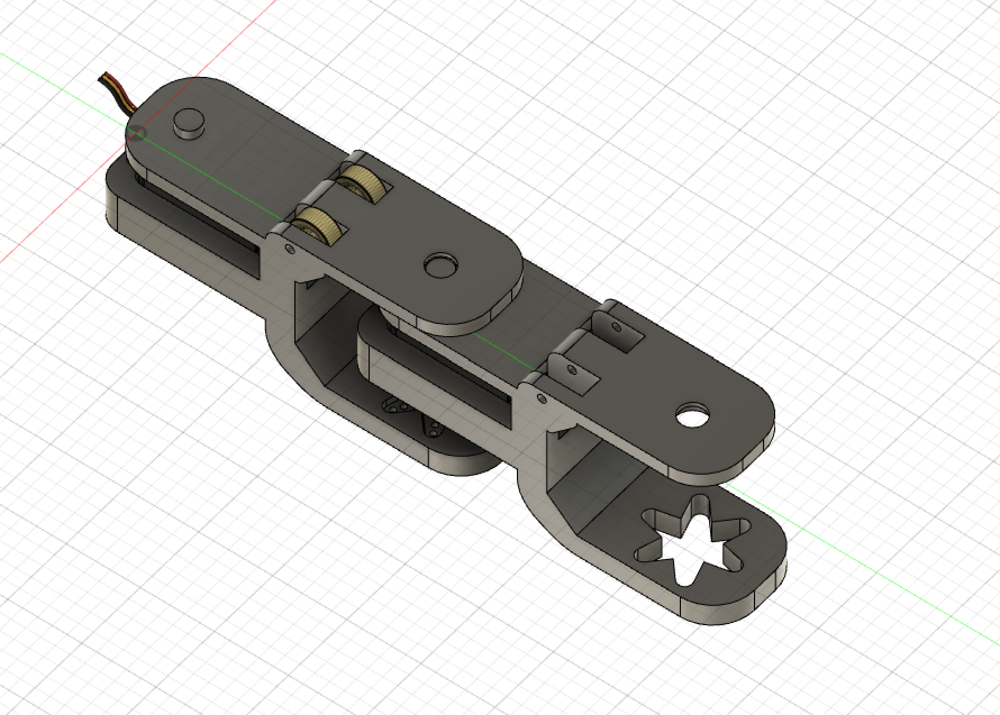
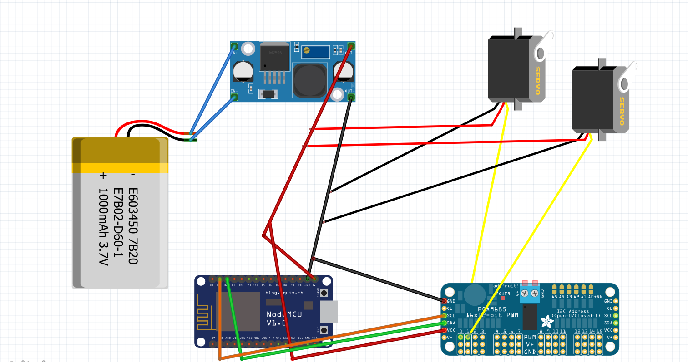
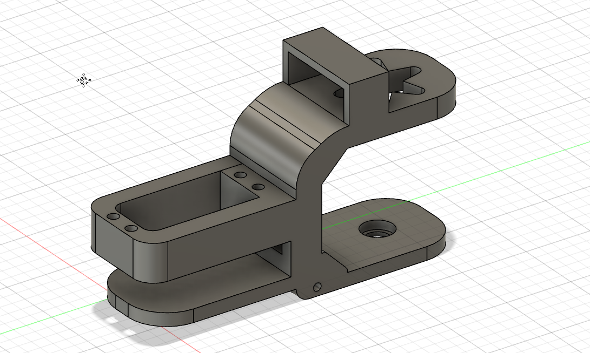
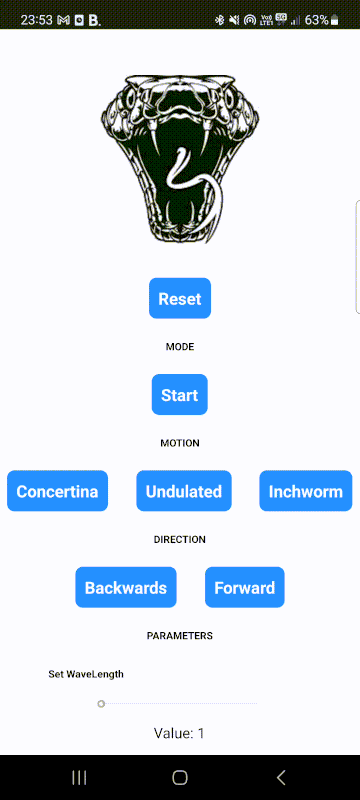
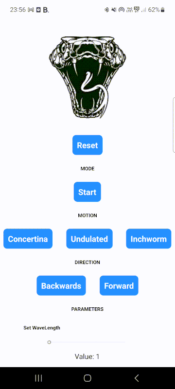

# Flipper - Snake Robot
Flipper is a fully 3D-printed snake robot controlled by a react native app. It is composed of 13 pieces for a total length of 1m20 and it’s capable of moving fluidly on the ground. Flipper has 3 mode of motions: the Inchworm (in the name), the Concertina (an accordion) and the Undulation (sinusoidal form). 

-- insert videos --

## Motivation 
Serpentine robots are a groundbreaking innovation in robotics, captivating researchers and engineers with their unique physical characteristics and versatile capabilities. These flexible and slithering machines excel at navigating complex and confined spaces, offering immense potential in various fields, including search and rescue operations, industrial inspections, exploration, medical applications, surveillance and security, and hazardous environments.

In search and rescue scenarios, robotic snakes play a crucial role. Unlike traditional robots, they excel at maneuvering through narrow and cluttered environments, such as collapsed buildings or debris. With their flexible bodies, they can easily navigate tight spaces, climb obstacles, and explore inaccessible areas. Equipped with cameras and sensors, these robots transmit real-time data, aiding rescuers in locating survivors and assessing surrounding conditions.

Our objective was to undertake a project that would have practical relevance in the real world. The field of robotics is continuously evolving, and we saw the development of a robotic snake as a chance to deepen our understanding of robotics and gain practical experience in designing and building complex systems. As a group of five computer scientists with backgrounds in communication systems and computer science, we possess a solid understanding of algorithms, programming languages, and system design, which are essential components in the development of a robotic system.

While we may not have had direct experience in building robotic systems, we embraced the opportunity to expand our expertise. We were committed to researching the specific technologies and methodologies required to develop a robotic snake, including mechanical engineering principles and electrical systems.

## Preparation for the project
To prepare ourselves for our first project in robotic, we looked on similar projects on the web to see how we could start it. It didn't take long to find some examples of snake robots and the 2 we've choosen are

* https://www.instructables.com/Bioinspired-Robotic-Snake/
* https://www.instructables.com/Snake-Robot-1/

Additionnally, we had the chance to talk about snake robot with a PhD Student of the Bio-Robotic Lab at EPFL. She gives us ideas and recommendations for a good project in less than a semester, such as keep only one degree of freedom for the motion and to look at sinusoidal function to understand how works the undulated motion of a snake.

## Conception

### Material

* 1 LiPo Battery 2S 7.4V
* 1 ESP8266 microcontroller
* 1 PCA9685 servo motor controller
* 1 LM2596 DC-to-DC converter
* 12 DS6225MG Servo motors
* 48 M3 inserts (SIZE ?)
* 48 M3 10mm screws 
* 1 Adapter cable ModelCraft 58604
* A lot of cables and electric sheath
* 28 small lego wheels
* 2 Lasers 650mn 5V
* 12 bearings (SIZE ?)


### Piece design




#### 1.Important features

We had a relatively simple concept for the design, but we encountered some challenges. Our goal was to create a joint that could provide a wide range of motion, ideally spanning at least 180 degrees. Additionally, we needed the servo to be securely held with minimal looseness.

To achieve this, we devised an interlocking piece system with a single axis of rotation. This design allowed for a maximum range of motion of approximately -30 to 230 degrees (setting the 90 degree as the middle). For the servo motor, we opted for a straightforward holder with four holes, allowing us to screw the servos in place. To ensure a secure fit, we used inserts to provide the necessary thread pitch. This approach ensured a firm grip and enhanced stability for the servo.


#### 2. Movement propagation

Our next challenge was to transmit the movement from one piece to another along the servo's axis of rotation. To accomplish this, we picked one of the mounting heads of the servo. We duplicated its shape on our own piece so that when we assembled the two pieces together, we could attach the servo head from the top to the servo itself, completing the assembly.

We opted for a star-shaped head as it provided multiple points of contact with the next piece, making it easier to drive the movement. This approach proved to be highly successful. However, implementing the design required multiple attempts due to the complexity of the shape. After trials and errors, we finally achieved a well-fitting shape.
    

To ensure a secure fit and prevent any dislocation, we implemented two additional features. Firstly, we created an extrusion beneath the surface of one piece, and corresponding to it, a hole in the second piece. This design allowed for a solid interlocking system between the two pieces.

Secondly, to minimize friction between the pieces, we incorporated a bearing. The extrusion was designed to fit snugly into the bearing, enabling smooth movement and reducing friction.

These modifications proved effective in achieving a well-fitting and stable assembly.
 

#### 3. Allowing movement

Last but crucial point for the snake success is the addition of wheels. Indeed without this the snake would not go forward. It is due to the fact that the lateral friction created by the wheels forces the movement in one direction, and therefore allows it to move forward. It mimics what a real snake's scales does, increase friction in some direction. We really wanted to hide them as much as possible, to avoid people thinking they are driving the snake, instead of the undulated motion. The effort made to reduce their visibility result in a clean and elegant design.

#### 4. Designing the Head


The design of the head has been choosen accordly to our ideas for the cables and electronic management. We needed a head that can hold the microcontroller, the servos board, the converter and all the cables for the circuit. Even if, when all it's in place, it's a little bit messy inside head after placing the components, it's a good approach since they are protected by the plastic. 

--> image de la tete avec l'electronic

#### 5. Thinking ahead


The design is a cornerstone of the project. The smallest mistake could result in the failure of the entire project. We tried as much as possible to think about all possible problem that we could run into. One of them was cable management. In order to finish with a clean project we designed some hole in the piece that would let the cable run from tail to head. Unfortunately, we could not use them as the hole intended to accomplish this task were designed to small to fit the servo's end of the cable. 
    
### Electronics

The main job of our electronic components is to control our servo motors. To do that, we used a PCA9685 board which is designed to send PWM (Pulse-Wide Modulation) signals to move them. This board is then connected to our microcontroller that will contain all the code to move the servos. However, we had quite a few problems powering the whole circuit.



#### 1. Placing the Battery
Our original plan involved the use of three Lipo batteries 7.4V, which required careful consideration in terms of placement and accessibility. To accommodate these batteries securely, we designed three additional pieces with built-in holders. This design modification ensured that the batteries were not only firmly secured within the snake but also easily replaceable when needed. After a long discussion with members of the DLL building and professor Koch, we kept only 1 of them since putting them in parallel to have bigger current wasn’t something easy and could have damaged the batteries. Since these batteries are designed to supply a large amount of current in a small amount of time, this was not a bad choice.



#### 2. Power the servos from the battery directly
When we look at the schema of the electronics, there something strange because we don't connect the + and - cables of the servos to the PCA9685, but we share all the ground of the servos with the ground of the battery, and all the + of the servos with the + of the battery. In fact this idea was from our professor because ... EXPLANATION.

#### 3. Voltages and Currents
We had to look carefully at the constraints of our circuit because some components require specific voltages and currents. Here are the main requirements:

* Operating voltage of the servo motors: 4.8-6V
* Operating voltage of the ESP8366: 3.3V
* Voltage supply of the ESP8266: 5V
* Battery supply voltage: 7.4V
* Voltage supply of the PCA9685 board's circuit: 5V

Here, since we don't use the PCA9685 to power the servos, but only control them, we don't need to use the V+ port of the board which is designed for this stuff. With that, we can only power the board's circuit by the VCC port which requires 5V as we said. Since the battery provides 7.4V, we used a DC-to-DC converter to change the output voltage of the battery to 5.5V which was enough for powering the servos and not too much to power the microcontroller and the board's controller circuit. 

#### 4. Place for the electonics
A big challenge for us in this project was to minimize the number and the size of electronic components, especially because the snake doesn't have much surface area available for inserting components. After some time of thinking, we end up with the idea of putting everything inside and above the head of the snake. It's a good choice since all the electonics are in one place and so it's centralized. And even if someone can say that they will be too much cables near the head, we thought it would be better than having some cables going to the tail, other to the head. 

### Cable Management
The cable management has been a step connected with the electronic design of the project. We managed to group them with many zipties all along the snake until they reached the head. At this point, we designed the head with little holes to pass the cables through it to reach the board and the microcontroller. 

--> image of the holes of the head

The main challenge of that has been the soldering of the + and - cables for all servos to the ones of the battery after the converter. Even though it was very repetitive and not all that difficult, you had to be very careful not to get lost. If you miss a single weld, you're back to square one. 

--> images of the soldering of the +/-
  
## Software Design

The software is divided into 3 big parts: the code for **the motions**, the code for **the UI** and the **client-server communication**. In this section, we explain how we implemented them and why like that. The code for the UI is not really important to explain since it's only for the design of the app and it's React notions, but we will explain how the joystick works to fully control the snake.

### React Native App



The snake control application is a mobile app developed using React Native, a popular framework for building cross-platform applications. Written in TypeScript, a statically-typed superset of JavaScript, the code ensures code reliability through type checking. The snake control app allows users to control the snake's movements wirelessly. The application utilizes various components and libraries to create 2 main views: a home view where we can select the mode of motion and other parameters, and a user-friendly interface to control the snake after activating a motion.

The "game" mode of the application is designed in a way that facilitates the user experience of controlling the snake. We used a joystickbn to allow the user to control the snake. The app has taken various different faces throughout our project, initially, our goal was to be able to allow the user to enter any possible combination of parameters for the wavelength, amplitude, speed and frequency, but the more we tested out our snake's motion, we realized that random parameter inputs were not to the snake's advantage. We decided to abandon this idea to prevent the snake from making sudden movements and damaging itself. We have pre configured parameter inputs to plug into the snake at any moment the user wants it to turn right, left, go forwards or backwards. It's important to note that the application doesn't allow the user to go left or right if the inchworm motion is enabled and doesn't allow the user to go anywhere but forwards if the concertina motion is enabled. This is because we have to flip the snake over when the inchworm motion is enabled, imposing only 1 degree of freedom on the vertical axis.

Finally, with some solid background of computer science studies, we thought that React Native was a very straight-forward and intuitive framework to use for our snake project. By combining efficient state management, network communication, and intuitive user interface design, the application offers a seamless and engaging experience for controlling the snake wirelessly.



### Client-Server communication

A big software implementation has been the communication between the ESP8266 and the react native app. The first idea was to communicate by Bluetooth Low Energy (BLE) since it’s very simple to deploy. We realized several days after that the ESP8266 does not have a bluetooth module but a WIFI module.

We use it to deploy a web server on the ESP8266 to handle POST requests from the phone app to control the snake. Here for example is one of the route that we can use to reset the snake when a user clicks on the reset button.

``` cpp
// Server-side code
server.on("/reset", HTTP_POST, [](AsyncWebServerRequest *request) {
    if(request->hasParam("value", true)) {
      AsyncWebParameter* p = request->getParam("value", true);
      int value = p->value().toInt();

      if(value == 0) {
        motion_snake = NONE;
      }
      request->send(200, "text/html", "good"); 
    } else {
      request->send(404, "text/html", "Error reset"); 
    }
  });

```

```ts
// Client-side code
const App: React.FC<Props> = () => {
    // ... 
        
    const handleButtonReset = () => {
        sendRequests("value", "0", "reset");
    }
    
    // ... 

    function sendRequests(key: string, val: string, root: string) {
        axios.post('http://192.168.236.121/' + root, {
          [key]: val
        }, {
          headers: {
            'Content-Type': 'application/x-www-form-urlencoded'
          }
        }).then((response) => {
          console.log(response);
        }, (error) => {
          console.log(error);
        });

        }
   }  
   
   // ... 
   
   return (
        // ...  
    
        <TouchableOpacity onPress={handleButtonReset}>
          <Text>Reset</Text>
        </TouchableOpacity>   
        
         // ...        
   )
}
```

Client-side, the application utilizes a library called axios. Axios facilitates HTTP requests and enables the application to send commands and receive data from the snake. For instance, the ```sendRequests``` function is responsible for sending control commands such as starting or stopping the snake's motion, adjusting parameters like wavelength and amplitude, and selecting different motion modes like concertina or undulated.

### Movements and Controls

Let's finally talk about the motions of the snake. We will explain mathematically the functions implemented for them and also talk how they interact with the phone app, especially with the joystick. But first let's begin to talk about how we move the servos from the microcontroller. The servos, as we said before, are controlled by a special board using pulse-wide modulation signals, which is a method of controlling the average power delivered by an electrical signal. Without entering into the details, we can easily send "pulses" of a certain length to the servos to move them from an angle A to an angle B
  
#### 1. Inchworm
--> robin mon reuf

    
#### 2. Concertina

--> insert gif of concertina

As we see in the video, the snake contracts itself with a certain wavelength, lengthen half of its body, contracts the front half again while lengthening the tail. It has been surprisely the hardest motion because of this "step by step" motion on the ground. It's simple for it to rotate while moving and this was not expected. However, after a great deal of research, we realised that even in other projects, this movement was one of the hardest, at least more so than the undulated movement!

#### 3. Undulated

Lateral undulation is the main type of locomotion for snakes. It is the usual undulated movement that we intuitively think about when picturing a moving snake. To implement that, we had to look at the math behind this movement.

It turns out with surprise that the equation for a simple undulation was not really difficult because it’s only a sine wave (logic you should say). We have to be attentive to this motion because what we described lies on a continuous world, but our snake is composed of multiple servo motors with pieces of **fixed length**, which is something discrete, it's the opposite of a real snake that can extend his body. This was the part we were the most afraid of. We could have designed parts as perfect as possible, the fact that this sine equation is in a continuous world, we couldn't know if implementing it on our snake would work. It turns out that yes it worked!


    
## Limitation

## Improvements


