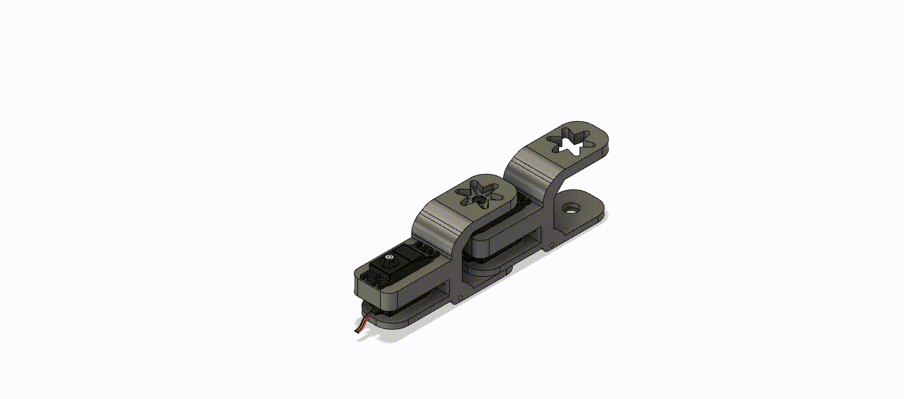

# Robotic Snake
Pour commencer voici une présentation de notre magnigique serpent: Flipper
## Motivation 
  These flexible and slithering machines excel at navigating complex and confined spaces, offering immense potential in various fields, including search and rescue operations, industrial inspections, exploration, medical applications, surveillance and security, and hazardous environments.

In search and rescue scenarios, robotic snakes play a crucial role. Unlike traditional robots, they excel at maneuvering through narrow and cluttered environments, such as collapsed buildings or debris. With their flexible bodies, they can easily navigate tight spaces, climb obstacles, and explore inaccessible areas. Equipped with cameras and sensors, these robots transmit real-time data, aiding rescuers in locating survivors and assessing surrounding conditions.

In the realm of medicine, robotic snakes hold promise as potential assistants in minimally invasive surgeries. Their flexible bodies and precise control enable access to hard-to-reach areas within the human body with minimal invasiveness. Surgeons can remotely control these robots, reducing the risk of complications and enhancing surgical outcomes in various medical specialties.

## Conception

### Material

### Piece design

The concept of the design is relatively simple, but there is some challenges. We had to design a joint, that allowed a good range of motion, at least from 0 to 180 degrees. Moreover, the servo needed a strong hold with minimum looseness. In order to do so we design an interlocking piece that locks together along one axis. Which allowed a maximum range of motion from -30 to 230 degree approxiamatly. For the servo we just design a simple hold, in which we designed four hole in order to screw the servos in. In those hole we had to put insert in order to have the thread pitch. This allowed the servo to have a firm grip and be really stable. 

    

    1. Key points

    2. Why wheels ?
    
### Electronics

### Cable Management
  
## Code
 
### Application

### Client-Server communication

### Controls

### Movements
  
    1. Inchworm
    2. Concertina
    3. Undulated
 
## Limitation

## Improvements

