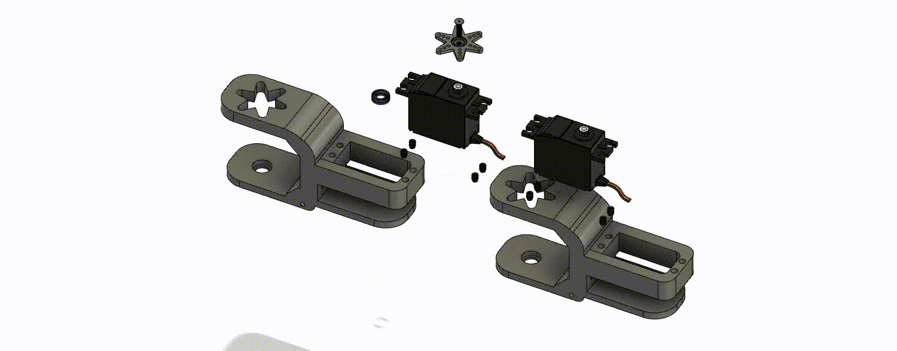
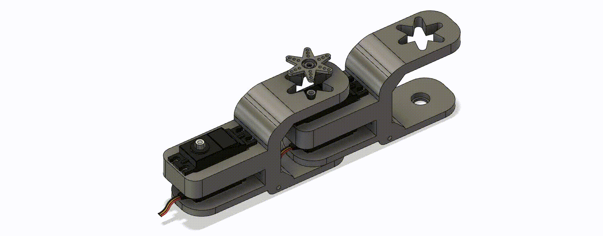
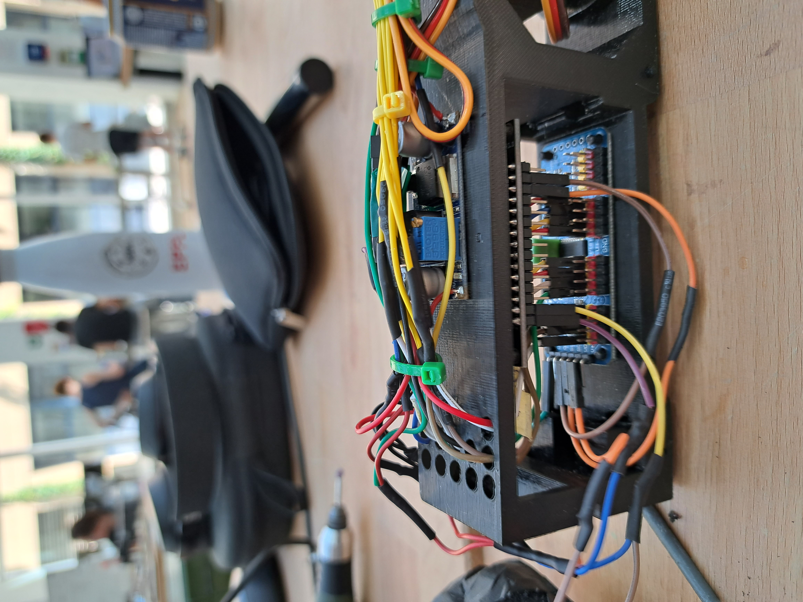
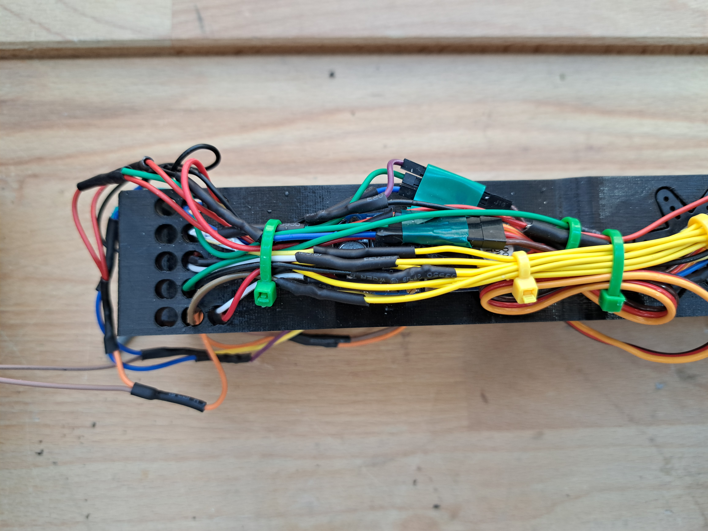
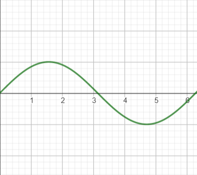

# Flipper - Snake Robot - Making Intellingent Things Project 2023 - Spring Semester
Meet Flipper, an impressive snake robot measuring 1m20 and crafted from 13 intricately designed 3D-printed pieces. With its remarkable capabilities, Flipper elegantly navigates and explores its surroundings. This versatile robot boasts 3 distinct modes of motion: Inchworm, Concertina, and Undulation. The Inchworm mode enables precise inch-by-inch movement, the Concertina mode mimics the graceful accordion-like motion. In the Undulation mode, Flipper effortlessly slithers with a mesmerizing sinusoidal movement. Flipper's innovative design and diverse locomotion options make it a remarkable robotic creation. 

-- insert videos --

## How to reproduce the snake

### Mount the snake
* Take the stl files of the snake. Print the main piece 8 times (the one without the holder for a battery), 3 times the one that can hold a battery, the tail one time, the head one time and the snake head on time. Pay attention to fully clean the holes for the wheels to avoid contact with the pieces
* Print also the 28 wheels and the 14 sticks to place them below the pieces
* Follow the first animation of the piece design section to mount the pieces together with the bearings and servos. Don’t forget to place the pieces that can hold a battery. You can place them where you want however keep in mind that they can help to pass cables through them. After that you should have a full length snake. 
* Mount the boards on the head piece as you will see in the animations, and the battery in its holder. A crucial stage now is to make the cable management. Follow the images and the details below in the readme to see how to connect all the cables, as well as connecting the cables to the PCA board, NodeMCU, the DC-to-DC converter and the battery. Exercise caution during this step, ensuring that you correctly connect the cables as per the provided diagram. Regarding the cable lengths required for a complete assembly, the yellow cable spans 5 meters, while the ground and the plus cables measure 3 meters each. For the head of the snake, you can place it as you want.

### Arduino code
* Download these following softwares on your computer : 
* the Arduino IDE app
* Set the Arduino IDE with NodeMCU ESP8266 (there are tutorials if needed on YouTube) 
* Add the board manager link in Arduino IDE Files < Preferences < Additional Board Manager URLs field : https://arduino.esp8266.com/stable/package_esp8266com_index.json 
* Install the esp8266 toolchain in the Tools -> Board -> Boards Manager
* Select Tools->Board->"ESP8266 Boards (some version)"->"NodeMCU V0.9 (ESP-12 Module)".
* And you may need to install : https://www.silabs.com/developers/usb-to-uart-bridge-vcp-drivers?tab=downloads

* Clone the Arduino code from the arduino-commands repository 
* Connect your computer to the ESP8266 board via a micro usb cable
* Change the ssid and password of your hotspot
* Upload the code to the board and connect the battery to the snake
* Verify in Serial Monitor that it prints Wifi Connected indicating that the board successfully connected to your wifi

### The React Native App
* Clone the react-native-esp-app repository locally on your machine. 
* Install NodeJS for your operating system
* Install expo-cli with this terminal command : `npm install -g expo-cli` / If there is a problem with windows restriction, copy paste this command into the Powershell `Set-ExecutionPolicy -Score CurrentUser -ExecutionPolicy RemoteSigned`
* Install expo client on your phone
* Navigate to the : react-native-esp-app folder on your computer. In App.tsx change line 53’s IP address with the IP address that will be printed in the Serial Monitor of the Arduino IDE app. 
* Write `expo start` in the terminal
* Scan the QR code with your phone, which will open the app

### How to launch the snake
* Enable your hotspot
* Start the app on your phone
* Connect the battery to the snake
* Have fun!


## Motivation 
Serpentine robots are a groundbreaking innovation in robotics, captivating researchers and engineers with their unique physical characteristics and versatile capabilities. These flexible and slithering machines excel at navigating complex and confined spaces, offering immense potential in various fields, including search and rescue operations, industrial inspections, exploration, medical applications, surveillance and security, and hazardous environments.

In search and rescue scenarios, robotic snakes play a crucial role. Unlike traditional robots, they excel at maneuvering through narrow and cluttered environments, such as collapsed buildings or debris. With their flexible bodies, they can easily navigate tight spaces, climb obstacles, and explore inaccessible areas. Equipped with cameras and sensors, these robots transmit real-time data, aiding rescuers in locating survivors and assessing surrounding conditions.

Our objective was to undertake a project that would have practical relevance in the real world. The field of robotics is continuously evolving, and we saw the development of a robotic snake as a chance to deepen our understanding of robotics and gain practical experience in designing and building complex systems. As a group of five computer scientists with backgrounds in communication systems and computer science, we possess a solid understanding of algorithms, programming languages, and system design, which are essential components in the development of a robotic system.

While we may not have had direct experience in building robotic systems, we embraced the opportunity to expand our expertise. We were committed to researching the specific technologies and methodologies required to develop a robotic snake, including mechanical engineering principles and electrical systems.

## Preparation for the project
After doing extensive research, we encountered 2 existing snake projects that served as profound inspiration for Flipper: 

* https://www.instructables.com/Bioinspired-Robotic-Snake/
* https://www.instructables.com/Snake-Robot-1/

Furthermore, our journey led us to a valuable encounter with a PhD student from the Bio-Robotic Lab at EPFL. During our conversation, she generously shared her insights and recommendations for a successful project within a shorter timeframe. One key suggestion was to focus on a signle degree of freedom for motion, ensuring efficiency and feasability. Additionally, she encouraged us to explore the mechanics behind sinusoidal functions, shedding light on the intriguing undulated motion exhibited by snakes. These valuable ideas and guidance have profoundly influenced our approach to Flipper's developpement. 

## Conception

### Material

* 1 LiPo Battery 2S 7.4V
* 1 ESP8266 microcontroller
* 1 PCA9685 servo motor controller
* 1 LM2596 DC-to-DC converter
* 12 DS6225MG Servo motors
* 48 M3 0.5 inserts
* 48 M3 10mm screws 
* 1 Adapter cable ModelCraft 58604
* A lot of cables and electric sheath
* 28 small lego wheels
* 2 Lasers 650mn 5V
* 12 bearings 12x8mm


### Piece design




#### 1.Important features

Initially, our design concept for Flipper was relatively straightforward. However, as we delved deeper into the design and development process of the pieces, we faced a number of challenges. Our primary objective was to create a joint capable of achieving a broad range of motion, ideally spanning at least 180 degrees. Additionally, we strived to ensure that the servo was securely held in place, with minimal looseness or play. Overcoming these obstacles became essential in achieving the desired functionality and stability of Flipper's design.

To accomplish our goal, we developed an interlocking piece system featuring a single axis of rotation. This design enabled us to achieve a wide range of motion, spanning from approximately -30 to 230 degrees, with the middle position set at 90 degrees. By utilizing this system, we ensured that Flipper could move smoothly and effectively within this expansive range.
For the servo motor, we opted for a simple yet effective holder design. This holder featured four holes strategically positioned to allow us to securely fasten the servos in place. To further enhance stability and ensure a tight fit, we utilized inserts with the appropriate thread pitch.


#### 2. Movement propagation

The subsequent obstacle we faced involved transmitting the motion from one piece to another along the servo's axis of rotation. To address this challenge, we leveraged the star-shaped mounting head of a servo as a reference point. By incorporating a corresponding hollow shape in our own piece design, we were able to seamlessly connect and interlock two segments (refer to the attached picture).

Our decision to utilize a star-shaped head stemmed from its advantageous feature of offering multiple points of contact with the subsequent piece. This choice greatly facilitated the transmission of movement, making it more manageable to drive the desired motion. 



To ensure a secure fit and prevent any dislocation, we implemented two additional features. Firstly, we created an extrusion beneath the surface of one piece, and corresponding to it, a hole in the second piece. This design allowed for a solid interlocking system between the two pieces.
Secondly, to minimize friction between the pieces, we incorporated a bearing. The extrusion was designed to fit snugly into the bearing, enabling smooth movement and reducing friction.
These modifications proved effective in achieving a well-fitting and stable assembly.

Although this approach proved highly successful, implementing the design was not without its challenges. The intricate shape posed complexities that necessitated multiple attempts and iterations. Through perseverance and a process of trial and error, we ultimately achieved a well-fitting shape that perfectly served our intended purpose.
 


#### 3. Allowing movement

A fundamental and indispensable component that ensures the accurate movement of the snake is the incorporation of wheels. The lateral friction generated by these wheels imparts a unidirectional force, enabling the snake to move effectively. This mechanism aims to mimic the natural function of snake scales, which enhance friction in specific directions. Our primary objective was to minimize the visibility of the wheels, preventing any misperception that they are directly driving the snake's motion, contrary to its undulated movement. The meticulous effort invested in concealing the wheels yields a sleek and sophisticated design, emphasizing the clean aesthetics of the overall structure.

#### 4. Designing the Head

The design of the head was significantly influenced by our considerations for cable management and electronic components. Our goal was to accommodate a microcontroller, servo board, converter, and all the necessary circuit cables within the head. While the assembly of these components inside the head may appear somewhat intricate, we believe it to be a sound approach. This design choice offers the advantage of providing protection for all the internal elements, despite the potential complexity of the arrangement.




#### 5. Thinking ahead

The design aspect of the project is of utmost importance, as even the smallest oversight could lead to the failure of the entire endeavor. We made a conscientious effort to anticipate and address all potential challenges that could arise. One such challenge was cable management. To ensure a polished end result, we incorporated holes in each piece to allow the cables to seamlessly traverse from the tail to the head. However, we encountered a setback as these holes turned out to be too small to accommodate the servo's cable end.


    
### Electronics

The primary role of our electronic components is to effectively control the servo motors. To accomplish this, we utilized a PCA9685 board specifically designed for transmitting PWM (Pulse-Width Modulation) signals to the servo motors. This board was then connected to our microcontroller, which housed the necessary code for servo movement. However, we encountered several challenges when it came to powering the entire circuit, which will be elaborated upon in the subsequent sections.


#### 1. Placing the Battery

Initially, our plan involved utilizing three 7.4V Lipo batteries, which necessitated careful consideration regarding their placement and accessibility. To securely accommodate these batteries, we devised three additional pieces with integrated holders. This design adaptation ensured that the batteries were not only firmly held within the snake but also easily replaceable when required.
However, following an extensive discussion with members of the DLL building and Professor Koch, we made the decision to reduce the battery count to just one. The consideration was primarily due to the challenges associated with parallel connection to achieve a higher current output, which could potentially risk damaging the batteries. Given that these batteries are specifically designed to deliver a significant amount of current within a short duration, opting for a single battery proved to be a prudent choice


#### 2. Powering the servos directly from the battery

Upon examining the electronic schema, an intriguing observation arises: the servo motors' positive and negative cables are not directly connected to the PCA9685. Instead, we have implemented a configuration where all the servo grounds are connected to the battery ground, and all the servo positive terminals are linked to the battery's positive terminal.
This unique arrangement serves a specific purpose within the circuit design, providing a common ground for the servos and maintaining a shared power source through the battery's positive terminal. In fact this idea was from our professor because we were worried that there would be too much current from the servos. Using only the signal pins means we don't have to power the servos via the PCA9685. 

#### 3. Voltage and Current

Our circuit design faces various constraints due to specific voltage and current requirements of different components:

* The servo motors operate within a voltage range of 4.8-6V.
* The ESP8366 module operates at 3.3V.
* The ESP8266 module requires a voltage supply of 5V.
* The battery supplies a voltage of 7.4V.
* The PCA9685 board's circuit needs a 5V voltage supply.

Since we utilize the PCA9685 board solely for servo control and not for powering them, we do not need to utilize the V+ port, which is intended for servo power supply. As a result, we power the board's circuit exclusively through the VCC port, requiring a 5V input voltage. Considering the battery supplies a voltage of 7.4V, we incorporated a DC-to-DC converter to transform the battery's output voltage to 5.5V. This voltage level proved sufficient to power the servos while remaining within an appropriate range for the microcontroller and the board's controller circuit 

#### 4. Placement of the electronic components

Minimizing the number and size of electronic components posed a significant challenge in our project, particularly due to the limited surface area available on the snake for their placement. After careful consideration, we devised a solution: consolidating and integrating all the electronic components inside and above the snake's head. This decision proved advantageous as it centralizes all the electronics in one location.
Although one might argue that this approach leads to a cluster of cables near the head, we deemed it a superior alternative to the idea of routing cables to both the tail and the head. By concentrating the cables in one area, we achieved a more streamlined and organized design. Moreover, having all the electronics in close proximity is convenient as it provides easy access to the necessary components.

### Cable Management

Efficient cable management is intricately intertwined with the electronic design of our project. To tackle this challenge, we successfully employed numerous zip ties to neatly bundle the cables together. At this juncture, we implemented a thoughtful design for the head, incorporating small holes that allow the cables to pass through and connect to the board and microcontroller. 



One of the primary challenges pertaining to the cables revolved around soldering the positive and negative wires of all the servos to the corresponding terminals of the battery after the converter. While the process itself was repetitive and not excessively complex, it required utmost caution to avoid any missteps. A single missed solder joint would necessitate starting over from the beginning, amplifying the importance of being attentive to detail throughout the soldering process.
  
## Software Design

The software architecture is structured into three main components: **the motions**, the code for **the UI** and the code for **the client-server communication**. In this section, we will delve into the implementation details and the reasoning behind each component. While the UI code primarily focuses on the design aspects of the application and utilizes React principles, we will specifically highlight the functionality of the joystick, which plays a crucial role in fully controlling the snake.

### React Native App

The snake control application is a mobile app developed using React Native, a popular framework for building cross-platform applications. Written in TypeScript, a statically-typed superset of JavaScript, the code ensures code reliability through type checking. The snake control app allows users to control the snake's movements wirelessly. The application utilizes various components and libraries to create 2 main views: a home view where we can select the mode of motion and other parameters, and a user-friendly interface to control the snake after activating a motion.


The "game" mode of the application is designed in a way that facilitates the user experience of controlling the snake. We used a joystickbn to allow the user to control the snake. The app has taken various different faces throughout our project, initially, our goal was to be able to allow the user to enter any possible combination of parameters for the wavelength, amplitude, speed and frequency, but the more we tested out our snake's motion, we realized that random parameter inputs were not to the snake's advantage. We decided to abandon this idea to prevent the snake from making sudden movements and damaging itself. We have pre configured parameter inputs to plug into the snake at any moment the user wants it to turn right, left, go forwards or backwards. It's important to note that the application doesn't allow the user to go left or right if the inchworm motion is enabled and doesn't allow the user to go anywhere but forwards if the concertina motion is enabled. This is because we have to flip the snake over when the inchworm motion is enabled, imposing only 1 degree of freedom on the vertical axis.

Finally, with some solid background of computer science studies, we thought that React Native was a very straight-forward and intuitive framework to use for our snake project. By combining efficient state management, network communication, and intuitive user interface design, the application offers a seamless and engaging experience for controlling the snake wirelessly.


### Client-Server communication

To establish communication between the ESP8266 and the React Native app, we initially planned to utilize Bluetooth Low Energy (BLE) due to its simplicity and ease of deployment. However, we soon realized that the ESP8266 lacked a Bluetooth module and instead possessed a Wi-Fi module. This prompted us to change our approach and leverage the Wi-Fi capabilities of the ESP8266.
To enable communication between the React Native app and the ESP8266, we deployed a web server on the ESP8266. This web server served as a central hub to handle incoming POST requests from the app, allowing for seamless control of the snake. Within the web server, we implemented multiple routes to handle various POST requests from the client (the app). One example is the route designed for resetting the snake. When the user pressed the "reset" button in the app, a corresponding POST request was sent to the designated endpoint on the ESP8266. This triggered the necessary actions to reset the snake to its initial state. Here is the code that illustrates the "receive" function on the server side.

``` cpp
// Server-side code
server.on("/reset", HTTP_POST, [](AsyncWebServerRequest *request) {
    if(request->hasParam("value", true)) {
      AsyncWebParameter* p = request->getParam("value", true);
      int value = p->value().toInt();

      if(value == 0) {
        motion_snake = NONE;
      }
      request->send(200, "text/html", "good"); 
    } else {
      request->send(404, "text/html", "Error reset"); 
    }
  });

```

```ts
// Client-side code
const App: React.FC<Props> = () => {
    // ... 
        
    const handleButtonReset = () => {
        sendRequests("value", "0", "reset");
    }
    
    // ... 

    function sendRequests(key: string, val: string, root: string) {
        axios.post('http://192.168.236.121/' + root, {
          [key]: val
        }, {
          headers: {
            'Content-Type': 'application/x-www-form-urlencoded'
          }
        }).then((response) => {
          console.log(response);
        }, (error) => {
          console.log(error);
        });

        }
   }  
   
   // ... 
   
   return (
        // ...  
    
        <TouchableOpacity onPress={handleButtonReset}>
          <Text>Reset</Text>
        </TouchableOpacity>   
        
         // ...        
   )
}
```


On the client-side (the app), the application harnesses the power of the axios library to facilitate HTTP requests, allowing seamless communication between the app and the snake robot. Axios serves as a valuable tool for sending commands and receiving data from the snake.
Within the application, a function called "sendRequests" takes charge of sending control commands to the snake. This function enables various actions, such as initiating or halting the snake's motion, adjusting parameters such as wavelength and amplitude, and selecting different motion modes like concertina or undulated. By utilizing axios, these commands are efficiently transmitted to the snake, allowing for precise control and customization of its behavior.

### Movements and Controls

Let's dive into the motion capabilities of the snake and how we control the servos from the microcontroller. As previously mentioned, the servos are controlled by a specialized board using pulse-width modulation (PWM) signals. This method allows us to precisely control the average power delivered to the servos.
In simple terms, we can send pulses of a specific length to the servos, which will move them from one angle (Angle A) to another angle (Angle B). By manipulating the length of these pulses, we can control the position and movement of the servos.
Now, let's discuss the mathematical functions that govern the snake's motion and how they interact with the phone app, particularly the joystick control.


``` cpp
#define MIN_PULSE_WIDTH 800
#define MAX_PULSE_WIDTH 2000
#define FREQUENCY_SERVO 50

Driver driver = Driver(0x40);

int rotate_with_min_max(int servo, double angle) {

  int pulse_wide = map(angle, 0, 180, MIN_PULSE_WIDTH, MAX_PULSE_WIDTH);

  return int(float(pulse_wide) / 1000000 * FREQUENCY_SERVO * 4096);
}

driver.setPWM(5, 0, rotate_with_min_max(5, 80));
```


In the provided code snippet, you can see that we define the minimum and maximum pulse widths as 800 and 2000 microseconds, respectively. These values represent the range of pulses that we can send to rotate the servos, allowing us to move them from 0 to 180 degrees. For instance, a pulse width of 800 microseconds would correspond to a servo position of 0 degrees.
Additionally, we set the frequency to 50Hz, which means that we can update the position of each servo 50 times per second. This frequency ensures smooth and responsive servo movements.
To rotate a specific servo to a desired angle, we use the "setPWM" function. In the provided example, the function "rotate_with_min_max" is called to convert the desired angle (80 degrees in this case) into the corresponding pulse width value within the defined range. This conversion is achieved using the "map" function from the Arduino library, which maps a range of values to another range of values.
Finally, it's important to note that the PCA9685 board operates at a 12-bit resolution. Therefore, the pulse width value needs to be converted into a 12-bit value (ranging from 0 to 4095) to match the resolution of the PCA9685.

With the understanding of how the servos are controlled, let's now explore the different motions implemented for the snake.
  
#### 1. Inchworm


To achieve an inchworm-like motion, a modification is required in the snake's position. Instead of moving in a lateral undulating manner, we need to flip over the snake to allow it to move freely in the vertical direction and straight forward, rather than to the side.
By flipping the snake, the direction of movement changes, and the snake can simulate the inchworm motion. This modification involves adjusting the sequence of segment movements and the coordination between the head and tail segments.
To move, the robotic inchworm extends one segment forward while simultaneously contracting the adjacent segment backward. This action creates a looping or undulating motion similar to that of a real inchworm.

    
#### 2. Concertina


In the video, you can observe that the snake performs a unique motion characterized by contracting itself with a specific wavelength, lengthening half of its body, contracting the front half once again, and simultaneously lengthening the tail. Surprisingly, this motion was proved to be the most challenging aspect of a snake's movements, mainly due to its "step-by-step" nature on the ground.
Extensive research revealed that this particular motion, known as the concertina movement, is inherently complex, even in other snake projects. It presents greater difficulties compared to the undulated movement, which involves a smoother wave-like motion.
The development and successful implementation of the concertina motion required careful analysis, experimentation, and fine-tuning to achieve the desired results. The challenges encountered during this process highlight the intricate nature of replicating snake locomotion in a robotic systems.

#### 3. Undulated

--> insert gif of undulated

Lateral undulation, the typical undulating movement of a snake, was the primary locomotion type we aimed to achieve in our project. Implementing this motion required a closer look at the underlying mathematics.
Surprisingly, the equation for a simple undulation was not overly complex; it could be represented by a sine wave. In fact, let's consider it over his period 2$\pi$ with 12 equidistant points that represent the 12 servo motors of our snake.



We can see that undulation is quite similar to this function (or more generally with trigonometric functions). Let's now add some phase term to it to see how it changes the graph

--> image phase pi/4 avec 12 points

This function can be written like this $\sin(x + \frac{\pi}{4})$, where $\frac{\pi}{4}$ is the phase term, meaning that we shift the function to the left with a value of $\frac{\pi}{4}$. The idea to simulate a wave form now is to continuously change the phase term from 0 to 2$\pi$.

<iframe src="https://www.geogebra.org/calculator/bxwqg3t7?embed" width="800" height="600" allowfullscreen style="border: 1px solid #e4e4e4;border-radius: 4px;" frameborder="0"></iframe>

We can see here a wave that seems to propagates. Now, each servo is represented by a point on the period of the graph, and each point represent a value of the sine function at a particular input `x` ; and with the animation, at a specific time `t`. The time variable can be now interpreted by this phase term that continuously change. If we say that each servo value has to follow on of this points, then it's value will look as the sine wave for a particular point `x`. 

In theory, this may seem logical, but there was a crucial consideration to keep in mind. While our concept of undulation exists in a continuous world, our robotic snake consists of discrete components with **fixed length**, unlike a real snake that can extend its body. This aspect posed a significant challenge and was a source of concern for us. No matter how well-designed our parts were, implementing a continuous sine wave equation on our snake remained uncertain.
However, through rigorous testing and experimentation, we discovered that our implementation of the sine wave equation for lateral undulation did indeed work. The coordinated movement of the servo motors and the discrete segments produced a convincing simulation of the undulating motion observed in real snakes. The final function for this motion is the following

``` cpp
void undulated_motion() {
  for(int i = 0; i < 360; i++) {
  
    float brads = i * 3.1415 / 180.0; 

    for(int j = 0; j < N_SERVOS; j++){  
      
      if(dir_snake == FORWARD) {
          rotate(j, 90 + offset + amplitude * sin(frequency * brads + (wavelength * j * 2 * 3.1415) / (N_SERVOS - 1)));
       } else {
          rotate(j, 90 + offset + amplitude * sin(-frequency * brads + (wavelength * j * 2 * 3.1415) / (N_SERVOS - 1))); 
      } 
    }
   delay(10);
  }
}
```
First we have an outer loop going from 0 to 2$\pi$ that representing the input values of the function (it's domain of definition). We convert them into radians to make easier the calculation. Then we have this inner loop that represent the servos taking values from the sine wave over time. The function is different because we added parameters to change the behaviour of the function. What we see is that at a specific value `i` (so fixing the wave at a certain time), each servo is taking some value between `[90 - amplitude, 90 + amplitude]` accordingly to the shape of the sine function for a specific wavelength. Additionnally, to say is that to change the speed of the wave, we can add a speed term, here called `frequency`, such that we complete a full period of the function in a different amount of time. Interpeting this with the complexe plane, this represent the speed at which we rotate around the unit circle. A last thing to say is that to make the snake go to the right or to the left, we add an integer value called `offset`, to the base angle which is 90 degree. With that, each servo will go a little bit more to the left or to the righteach each point in time.

We have now the time to explain how the joystick works to control the snake. We decided at the beginning of the project that we will only control the undulated motion because it was already quite challenging for one motion. Since controlling a snake is really close to a small electric car, a joystick is a great idea to move it. To make a joystick in react native, we needed a Gesture Handler framework called `react-native-gesture-handler` to handle the events of our fingers on the screen. After that, we created a react component that looks like a joystick and that can print the angle between the vertical axis and the finger. Vertically it’s 90 degrees and we can go to the right until 180 degrees and to the left until 0 degrees.


Now the angle that we have can’t just be sent to the microcontroller. It’s because of our implementation of the sinusoidal function. Like we said, to make the snake go to the right, we add some integer to the base angle of the servo motors: 90 degrees. Since now we receive an angle between 0 and 180 degrees, we need to map the angle of the joystick to an offset range for the arduino code. 

``` cpp
AsyncWebParameter* p = request->getParam("off", true);
double value = p->value().toInt();

int off = 0;
if(value <= 180) {
   off = map(value, 0, 180, -11, 11);
   if(off != offset) {
        update_offset(off);
   }
   request->send(200, "text/html", String(off)); 
} else {
   request->send(200, "text/html", "nothing"); 
}
``` 
In this code, we map the `value` angle received from the app to an offset range of -11 to 11. To add a much better interaction we did 2 things. First, since the angle values of the joystick are updated very rapidly, and since we send each angle to the microcontroller, then in the arduino code here we change the offset only if it's different than the one already in the `offset` variable. And second thing, we added a function to send only angles multiple of 10.

```ts
function findNearestMultipleOf10(input: number): number {
    const remainder = input % 10;

    if (remainder <= 5) {
      return input - remainder;
    }

    return input + (10 - remainder);
  }
```

With this done, we have a relatively smooth way to change the direction of the snake. 

    
## Limitation

Our project has encountered several noteworthy limitations that have influenced our progress and achievements. It is essential to acknowledge and comprehend these limitations, as they have played a crucial role in shaping our decision-making process. Moreover, we have successfully developed solutions within these boundaries posed by these limitations. By recognizing and addressing these limitations, we gain valuable insights for future improvements and refinements, and can maximize our project’s potential.

### Sensors
Having managed to attain our project’s priority, a functional undulating snake, our desire was to implement additional features, such as sensors. 

At first, we implemented sensors that would be able to detect potholes in its path. By wanting to challenge and implement a more impressive sensor functionality, we hoped, in a second step, that the snake would detect not potholes but objects, walls or other obstacles in its path, and that it would avoid these obstacles, either by changing his course or by stopping. 

The HC-SR04 ultrasonic sensors, utilizes ultrasonic waves to measure distances and detect objects in its surrounding environment. The working principle of the HC-SR04 sensor involves emitting ultrasonic pulses and calculating the time it takes for the echoes to return. It consists of two main components: a transmitter and a receiver. The transmitter emits high-frequency sound waves, which propagate through the air and bounce off any objects in their path. The receiver then detects the echoes and measures the time interval between transmission and reception. By using the speed of sound as a constant, the sensor can calculate the distance to the objects based on the time taken for the echoes to return. 

→ insert image of the function

The successful implementation of the Arduino code and the subsequent testing initially led us to believe that the sensor task was successfully completed. However, upon attempting to test the entire system, including the snake and sensors, we immediately observed that the snake was no longer performing its intended movements as programmed.

After conducting thorough research, we have determined that the Arduino ESP8266 lacks support for multi-threading, which accounts for the unexpected behavior of the snake. Specifically, the issue arises during the time that elapses from  the emission of high-frequency waves by the transmitter to the detection of echoes by the receiver. As a result, the snake becomes unable to execute its movement instructions concurrently.

To address this challenge, a viable solution would have been to utilize two interconnected Arduino ESP8266 devices - one dedicated to handling the snake’s movements and the other focused on sensor operations. This arrangement would have allowed for seamless collaboration between the two components, enabling them to function harmoniously and resolve the issue at hand.

### Concertina movement
Another goal we had originally envisioned to incorporate was to implement the concertina movement into our robotic snake's locomotion to navigate through narrow passages. This is a method of locomotion used by certain snake species in confined spaces. It involves the snake alternately anchoring parts of its body against the walls or objects and then pulling the rest of its body forward, creating accordion-like folds.
However, we faced challenges in implementing this complex motion due to the precise servo control and the internal force required. Anchoring the front portion of the body and extending it forward to pull the rest of the body along proved difficult. The inadequate grip of the wheels and the snake's insufficient weight made it challenging to generate the necessary downforce for effective propulsion. Due to insufficient downforce, the snake was pushed backward while extending it's front section, counteracting its forward movement. Similarly, when contracting the rear, the front part of the snake was pulled backward, causing it to remain stationary or make minimal progress.

### Second degree of freedom
Initially, our plan was to incorporate a secondary degree of movement that would allow the snake to slide over obstacles or steps. 
However, implementing this proved challenging since it required two servos per body part to enable both side-to-side and up-and-down motion. With our current setup of 12 servos, one for each body part, implementing this additional movement would have significantly increased the size of each piece, resulting in a larger and significantly heavier snake. Furthermore, our existing battery solution would not have been capable of powering an additional 12 servos. 
With additional time, we would have explored the possibility of introducing a secondary degree of movement to specific sections of the snake. For instance, we could have enabled the tail to mimic the rattling motion seen in rattlesnakes, or elevated the head to enhace sensory capabilities for better environmental scanning.

## Improvements

### Calibration of each servo
We could improve the robot by enhancing the calibration of the servos. Currently, we have observed a slight deviation to the right in the snake's movement. Upon investigation, we determined that the issue stems from the servos' range being from -20 to 160 degrees rather than the desired 0 to 180 degrees. This discrepancy is a result of servo calibration. To rectify this, we need to determine the precise pulse signal values that allow for movement to any angle between 0 and 180 degrees. Additionally, this calibration process must be done individually for each servo, rather than having a general minimum and maximum pulse width. With a more meticulous servo calibration, we can significantly enhance the snake's movement.

### Adding a new degree of freedom
Another important improvement involves introducing an additional degree of freedom, enabling the snake to lift its body upward. This added capability would facilitate a movement commonly observed in snakes known as "sidewinding," where the snake lifts a portion of its body to reduce friction and slither sideways. Incorporating this feature would greatly expand the range of movements the robot can perform.

Furthermore, it would be beneficial to incorporate sensors that prevent the snake from colliding with obstacles. Achieving this requires adding another NodeMCU and establishing communication between the two units. More details regarding this aspect will be discussed in the limitations.

### Replacing the wheels
Lastly, a noteworthy advancement would be to replace the wheels with a material that mimics the scales found on snakes. This modification would provide a more lifelike appearance to the robot, aligning it with the characteristics of actual snakes. However, it is important to note that this particular enhancement falls under the realm of a research-level project.


